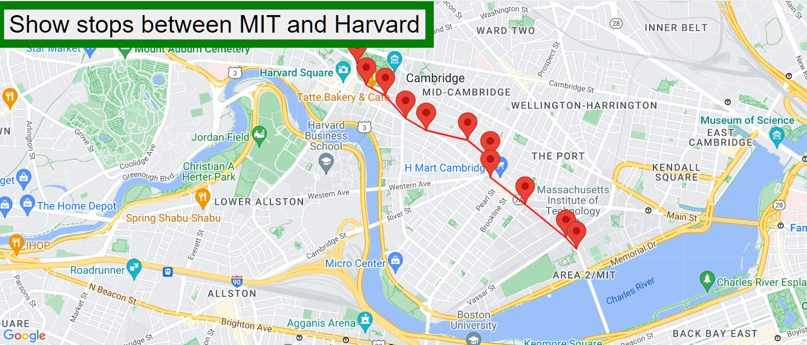

<h1> Real Time Bus Tracker</h1>
 
Real time Bus tracker app, shows stops between MIT & Harvard in Boston Area

 

  
 

<h2>Improvements included were:</h2>
<ul>
  <li>Added a ployline highlighting the bus route</li>
  <li>Added marker at each bus-stop to locate easily on the bus route</li>
  <li>Toolotip for bus stop</li>
</ul>  
<h2>How to Run:</h2>
<ul>
  <li>clone this repo git@github.com:manju-gitit/manju-gitit.github.io.git </li>
  <li>cd Real Time Bus Tracker/ </li>
  <li>load the index.html page in your browser and click'Show stops between MIT & Harvard' button </li>
</ul>  
<h2>Roadmap of future improvements: </h2>
 <ul>
  <li>Option to choose starting and end stops</li>
  <li>Add Bustop name, image etc. to the Marker</li>
  <li>Travel time between stops    </li>
<h2>License information:</h2>
  MIT License Copyright (c) 2023 Manjula Kasireddy
